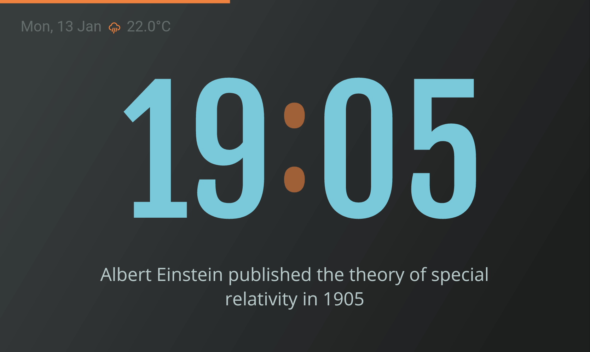

  <h1>Facts Clock</h1>
  <h5>Treat your brain with a cool number fact whenever you look at the time! 🤓🕗</h5>

<table>
  <tr>
    <th colspan="2">Clock Details</th>
  </tr>
  <tr>
    <td>Name</td>
    <td>Facts Clock</td>
  </tr>
  <tr>
    <td>Description</td>
    <td>This clock face randomly picks an interesting fact about the number corresponding to the time digits at any point of time</td>
  </tr>
  <tr>
    <td>UI</td>
    <td></td>
  </tr>
  <tr>
    <td>Type</td>
    <td>Digital</td>
  </tr>
  <tr>
    <td>Themes</td>
    <td>Light & Dark</td>
  </tr>
  <tr>
    <td>Seconds&nbsp;indication</td>
    <td>Yes</td>
  </tr>
  <tr>
    <td>Scaling ideas</td>
    <td>The info shown now is based on the time-digits number. Instead it can be any tiny piece of info tailored for the user - news highlights or any <em>'did you know?'<em> random fact corresponding to the user's preferences.</td>
  </tr>
  <tr>
    <td>Author</td>
    <td>Praseetha KR (<a href="https://twitter.com/void_imagineer">@void_imagineer</a>)</td>
  </tr>
<table>
  

  
<table>
  <tr>
    <td align="center">Light Theme</td>
  </tr>
  <tr>
    <td align="center"></td>
  </tr>
</table>
 
<table>
  <tr>
    <td align="center">Dark Theme</td>
  </tr>
  <tr>
    <td align="center"></td>
  </tr>
</table>
 
